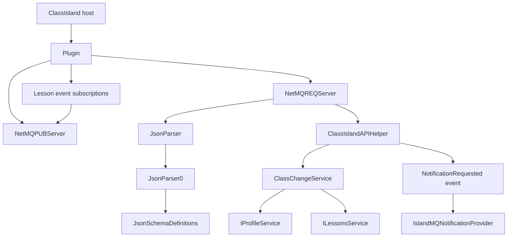
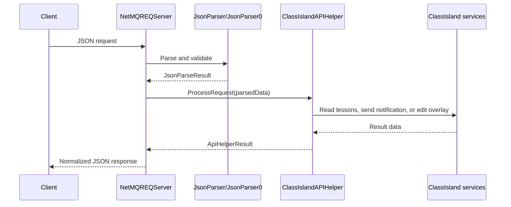

IslandMQ is organized around two runtime loops and one dispatcher. `Plugin.cs` wires the plugin into ClassIsland startup, `NetMQREQServer.cs` handles command traffic, `NetMQPUBServer.cs` handles broadcasts, and the helper classes under `utils/` interpret requests and mutate timetable state.

## Runtime Shape

The entry point is `Plugin.Initialize` in `Plugin.cs`. It registers `IslandMQNotificationProvider`, `NetMQREQServer`, and `NetMQPUBServer` into DI, then hooks `AppBase.Current.AppStarted` and `AppBase.Current.AppStopping`. That decision keeps socket startup aligned with the ClassIsland lifecycle instead of constructing sockets during plugin discovery, which would be too early for host services like `ILessonsService`.

The command path starts in `NetMQREQServer.RunServer` in `NetMQREQServer.cs`. The server binds a `ResponseSocket`, polls in short 50 ms intervals, assigns a monotonically increasing request ID, and calls `ProcessMessage`. `ProcessMessage` first delegates to `JsonParser.Parse`, which routes version `0` messages to `JsonParser0.Parse`, validates them with the schema chosen by `JsonSchemaDefinitions.GetSchemaForCommand`, and only then forwards the parsed JSON to `ClassIslandAPIHelper.ProcessRequest`.

The broadcast path is separate by design. `Plugin.RegisterLessonEvents` subscribes to `ILessonsService.OnClass`, `OnBreakingTime`, `OnAfterSchool`, and `CurrentTimeStateChanged`. Each handler does one thing: it calls `_netMqPubServer?.Publish("<event>")`. In `NetMQPUBServer.cs`, the publisher keeps a concurrent queue so event producers never block on socket I/O.

## Data Lifecycle

Every response is normalized inside `NetMQREQServer.CreateSuccessResponse` or `CreateErrorResponse`. That is why client code can always depend on `success`, `message`, `request_id`, `status_code`, and `version`, even when the inner command fails. The helper methods do not write to the socket directly; they only return `ApiHelperResult`, which keeps transport and business logic separated.

## Key Design Decisions

### Two sockets instead of one multiplexed channel

`NetMQREQServer` and `NetMQPUBServer` use different socket types and different ports. The repository README explicitly rejects WebSocket and custom HTTP transport, and the code follows that choice cleanly. This avoids shoehorning fire-and-forget events into a request socket and keeps client implementations simple in any ZeroMQ-capable language.

### JSON Schema before command dispatch

`JsonParser0.Parse` validates the request before command code sees it. That keeps `ClassIslandAPIHelper` focused on command semantics rather than basic message-shape validation. It also means adding a new command requires touching both `ClassIslandAPIHelper.ProcessRequest` and `JsonSchemaDefinitions.SchemaDictionary`, which makes protocol drift harder to introduce accidentally.

### Overlay-based schedule mutation

`ClassChangeService` never rewrites the original class plan in place. Instead, `GetOrCreateTempClassPlan` resolves the base plan and asks `IProfileService.CreateTempClassPlan` for a temporary overlay, then mutates that overlay. This matches how ClassIsland already models temporary schedule changes, so remote clients do not bypass UI expectations such as changed-class highlighting.

### Short polling and explicit shutdown guards

Both servers favor short waits, cancellation tokens, and manual reset events over long blocking calls. `NetMQREQServer.RunServer` polls every 50 ms and `NetMQPUBServer.RunServer` sleeps in 5 ms chunks when the queue is empty. Combined with the `StopInternal` methods, that keeps plugin shutdown predictable and avoids hanging the host on exit.

## How The Pieces Fit Together

If a remote tool sends `{"version":0,"command":"get_classplan","date":"2026-05-16"}`, the REQ server validates it, the helper fetches `ILessonsService` and `IProfileService`, builds an enriched projection that combines time layout rows with subject details, and the server serializes the result into the stable response envelope. If the host later transitions into a lesson period, the plugin's lesson event handler queues `OnClass` into the publisher, and any subscriber listening on `tcp://127.0.0.1:5556` receives it asynchronously.

That separation is the main architectural story of IslandMQ: command execution is synchronous and validated, event delivery is asynchronous and decoupled, and profile mutations are routed through the same ClassIsland abstractions the host already trusts.
