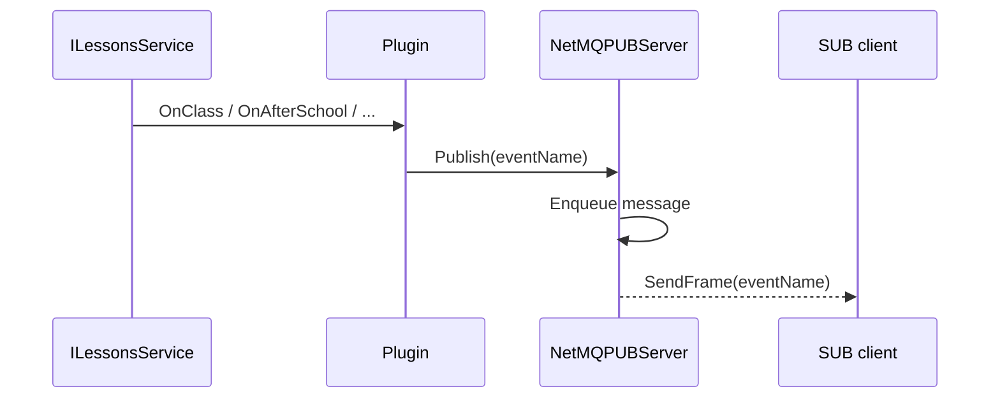

IslandMQ exposes ClassIsland lifecycle changes over a dedicated PUB socket at `tcp://127.0.0.1:5556`. This path is implemented by `NetMQPUBServer` in `NetMQPUBServer.cs` and is fed by the lesson event subscriptions registered in `Plugin.cs`.

## What The Concept Is

The plugin listens to `ILessonsService` events and publishes simple string messages for remote subscribers. The current event names are:

- `OnClass`
- `OnBreakingTime`
- `OnAfterSchool`
- `CurrentTimeStateChanged`

These are not request/response commands. Subscribers connect once, subscribe to all topics using an empty subscription string, and receive messages as the host changes state.



## Why It Exists

A request-only API would force clients to poll for changes like class transitions or end-of-day state. Polling is wasteful and introduces timing races. The publisher solves that by letting ClassIsland push state transitions to interested tools, while leaving data-heavy queries on the REQ side.

## Basic Example

```python
import zmq

ctx = zmq.Context()
sock = ctx.socket(zmq.SUB)
sock.connect("tcp://127.0.0.1:5556")
sock.setsockopt_string(zmq.SUBSCRIBE, "")

while True:
    print(sock.recv_string())
```

## Advanced Example

Pair the subscriber with on-demand queries. When `CurrentTimeStateChanged` arrives, refresh lesson data from the REQ endpoint.

```ts
import { Request, Subscriber } from "zeromq";

const req = new Request();
req.connect("tcp://127.0.0.1:5555");

const sub = new Subscriber();
sub.connect("tcp://127.0.0.1:5556");
sub.subscribe();

for await (const [msg] of sub) {
  const eventName = msg.toString();

  if (eventName === "CurrentTimeStateChanged") {
    await req.send(JSON.stringify({ version: 0, command: "get_lesson" }));
    const [reply] = await req.receive();
    console.log(JSON.parse(reply.toString()).data.CurrentState);
  }
}
```

## Internal Walkthrough

`Plugin.RegisterLessonEvents` subscribes to four `ILessonsService` events after the application starts. The event handlers do not build payload objects or perform additional reads. They simply call `_netMqPubServer?.Publish("<event>")`. `NetMQPUBServer.Publish` enqueues the string into a `ConcurrentQueue<string>`, and `RunServer` drains that queue on a background task. When the queue is empty, the task waits for 5 ms, which keeps CPU usage low without making shutdown sluggish.

The publisher has its own retry loop. `Start` resets `_startAttempts`, creates a new `CancellationTokenSource`, and launches `RunServerWithRetry`. If the socket cannot start, the code retries up to three times with a 10 second delay between attempts. This is important because event delivery is secondary to keeping the host alive; the plugin would rather log and stop the publisher than block ClassIsland startup indefinitely.

## Relationship To Other Concepts

PUB/SUB is independent from the [Request Protocol](/docs/request-protocol), but clients usually use both together: PUB/SUB tells you when something changed, and REQ/REP tells you what the current state is. That makes event broadcasting the trigger path rather than the data path.

<Callout type="warn">
PUB messages are bare strings, not structured JSON envelopes. If you need event payload details, you must subscribe for the trigger and then issue a follow-up REQ command such as `get_lesson` or `get_classplan`.
</Callout>

<Accordions>
<Accordion title="Why events are strings instead of JSON payloads">
String payloads keep the publisher extremely cheap to execute from UI-adjacent event handlers. The handlers in `Plugin.cs` do not need to serialize lesson objects, capture host state, or worry about partial reads from services during transitions. The downside is that subscribers need an extra round-trip to fetch details, but that cost is acceptable because REQ queries already provide normalized structured data. This split also keeps the event vocabulary stable even if the lesson data projection evolves later.
</Accordion>
<Accordion title="Why the publisher uses an in-memory queue">
`Publish` only enqueues and returns, so lesson event handlers never block on socket writes or network backpressure. That matters because these handlers run as part of the host's event system and should remain lightweight. The trade-off is that the queue is memory-backed and not persisted; if the publisher is stopped or disposed, queued events are lost. For lifecycle notifications like `OnClass`, that is a reasonable trade because clients can always resynchronize with `get_lesson`.
</Accordion>
</Accordions>
