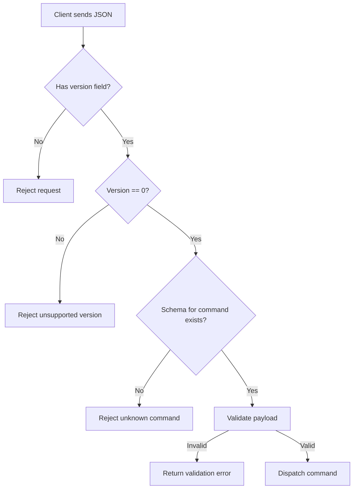

The IslandMQ wire protocol is the stable contract for external tools. Every request sent to `tcp://127.0.0.1:5555` must be a JSON object with a `version` field and a `command` field. The current implementation only supports protocol version `0`, enforced by `JsonParser.MIN_SUPPORTED_VERSION`, `JsonParser.MAX_SUPPORTED_VERSION`, and `JsonSchemaDefinitions.VersionZeroSchema`.



## What It Is Solving

Without a versioned protocol, client scripts have to guess which fields are required and whether a new plugin release changed the request shape. IslandMQ fixes that by making the version part of every message and validating the full payload before command execution. This is implemented in `utils/json-parser.cs`, `utils/json-parser-0.cs`, and `utils/JsonSchemaDefinitions.cs`.

## Response Envelope

Regardless of the command, `NetMQREQServer.ProcessMessage` returns a normalized JSON response:

```json
{
  "success": true,
  "message": "OK",
  "data": null,
  "request_id": 1,
  "status_code": 200,
  "version": 0
}
```

The `request_id` is assigned inside `NetMQREQServer.GetNextRequestId` and is useful for client-side logging. `status_code` behaves like an HTTP-style code even though the transport is ZeroMQ. Success responses come from `CreateSuccessResponse`; parse failures, validation failures, and command failures come from `CreateErrorResponse`.

## Basic Example

```python
import json
import zmq

ctx = zmq.Context()
sock = ctx.socket(zmq.REQ)
sock.connect("tcp://127.0.0.1:5555")

sock.send_string(json.dumps({
    "version": 0,
    "command": "time"
}))

reply = json.loads(sock.recv_string())
print(reply["message"])
```

## Advanced Example

This example sends a batch schedule change and handles validation errors explicitly.

```ts
import { Request } from "zeromq";

const client = new Request();
client.connect("tcp://127.0.0.1:5555");

await client.send(JSON.stringify({
  version: 0,
  command: "change_lesson",
  operation: "batch",
  date: "2026-05-16",
  changes: {
    "0": "550e8400-e29b-41d4-a716-446655440000",
    "2": "6ba7b810-9dad-11d1-80b4-00c04fd430c8"
  }
}));

const [raw] = await client.receive();
const response = JSON.parse(raw.toString());

if (!response.success) {
  throw new Error(`${response.status_code}: ${response.message}`);
}
```

<Callout type="warn">
Do not omit `version` even if you only target one plugin release. `JsonParser.Parse` rejects requests without it before command dispatch, so a missing version does not degrade gracefully into a default.
</Callout>

## How It Relates To Other Concepts

The protocol is the entry gate for every command described on [Command Processing](/docs/command-processing). It also constrains how schedule edits on [Schedule Overlays](/docs/schedule-overlays) are expressed and how remote clients decide whether to retry or surface an error.

## Internals Walkthrough

`JsonParser.Parse` first parses raw text into a `JsonDocument` and clones the root element so it can outlive the document. It then validates the presence and type of the `version` field, checks the supported version range, and dispatches to `JsonParser0.Parse` for version `0`. `JsonParser0.Parse` extracts `command`, fetches the matching schema via `JsonSchemaDefinitions.GetSchemaForCommand`, and runs `schema.Evaluate` with hierarchical output so nested validation errors can be flattened through `AllErrors`.

<Accordions>
<Accordion title="Why JSON Schema is worth the extra layer">
The schema pass duplicates some checks that the command handlers could perform themselves, but it centralizes the non-negotiable protocol contract in one place. That keeps handlers like `Notice` and `ChangeLesson` focused on semantic validation such as GUID parsing or domain-specific defaults. It also gives clients more consistent failure modes because malformed payloads are rejected before any host-side mutation happens. If you add a new command later, updating the schema and the dispatcher together is an intentional friction point that reduces accidental protocol drift.
</Accordion>
<Accordion title="Why version 0 is hard-coded today">
The parser only supports version `0`, which may look restrictive, but it simplifies both request validation and response compatibility while the command set is still evolving. `MIN_SUPPORTED_VERSION` and `MAX_SUPPORTED_VERSION` are public constants, so clients can explicitly code against the supported range instead of discovering compatibility by trial and error. The trade-off is that introducing version `1` will require a new parser branch and likely a second schema family. That extra work is exactly what preserves backward compatibility for existing automation clients.
</Accordion>
</Accordions>
