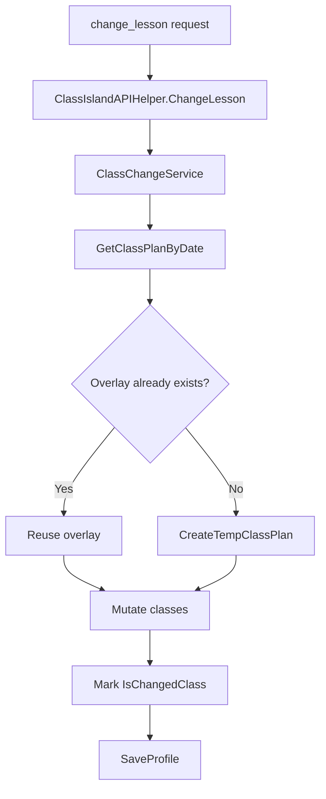

IslandMQ does not rewrite the base schedule directly. Schedule mutations go through `ClassChangeService` in `utils/ClassChangeService.cs`, which uses ClassIsland's temporary overlay model to replace, swap, batch edit, or clear classes for a specific date.



## What The Concept Is

An overlay is a temporary class plan layered on top of the original plan for one date. `GetOrCreateTempClassPlan` checks `Profile.OrderedSchedules` first. If that date already points at an overlay whose `OverlaySourceId` matches the original class plan, the service reuses it. Otherwise it asks `IProfileService.CreateTempClassPlan` to create a new one.

## Why It Exists

Directly mutating the original class plan would make temporary edits permanent and could bypass UI expectations in ClassIsland. The overlay approach lets IslandMQ represent remote changes the same way the host does, including the `IsChangedClass` flags used for highlighting. That keeps external automation aligned with the rest of the application instead of inventing a parallel mutation model.

## Basic Example

Replace one class by index for a date.

```json
{
  "version": 0,
  "command": "change_lesson",
  "operation": "replace",
  "date": "2026-05-16",
  "class_index": 1,
  "subject_id": "550e8400-e29b-41d4-a716-446655440000"
}
```

## Advanced Example

Batch changes are represented as an object whose keys are class indexes and whose values are subject GUIDs. Invalid entries are ignored and summarized in the success message.

```json
{
  "version": 0,
  "command": "change_lesson",
  "operation": "batch",
  "date": "2026-05-16",
  "changes": {
    "0": "550e8400-e29b-41d4-a716-446655440000",
    "3": "6ba7b810-9dad-11d1-80b4-00c04fd430c8",
    "invalid": "not-a-guid"
  }
}
```

## Internal Walkthrough

`ChangeLesson` first resolves `IProfileService` and `ILessonsService`, then creates `ClassChangeService`. For `replace`, `swap`, and `batch`, the service fetches the class plan for the target date, resolves the original class plan ID if the current plan is already an overlay, then works against the overlay returned by `GetOrCreateTempClassPlan`.

`ReplaceClass` validates the class index and the new subject GUID before updating `targetClassPlan.Classes[classIndex].SubjectId`. `SwapClasses` exchanges two `SubjectId` values and marks both classes as changed. `BatchReplaceClasses` validates all indices and all subject IDs before applying any changes, which prevents a partially applied batch from mixing valid and invalid edits. `ClearClassChanges` is intentionally simpler: it removes the dated entry from `OrderedSchedules`, causing ClassIsland to fall back to the original plan.

## Relationship To Other Concepts

This concept depends on [Command Processing](/docs/command-processing), because every mutation starts as a `change_lesson` command. It also feeds back into `get_classplan` and `get_lesson`, since those commands reflect the currently active overlay after a successful change.

<Callout type="warn">
Class indexes are not generic time-layout indexes. They refer to the ordered class list, which corresponds only to `TimeType == 0` rows. If your client uses visual timetable row numbers that include breaks, you will mutate the wrong class.
</Callout>

<Accordions>
<Accordion title="Overlay reuse versus creating a fresh overlay every time">
Reusing the existing overlay keeps a sequence of remote edits coherent across multiple requests during the same day. If each request created a new overlay, remote clients could silently stomp on each other's earlier changes or leave behind multiple temporary plans pointing at the same source. The cost of reuse is that clients need to treat the current overlay as shared mutable state, not a private transaction. That is why the sample FastMCP tool advises calling `get_classplan` before sending class indexes.
</Accordion>
<Accordion title="Why batch validation is all-or-mostly-nothing">
`BatchReplaceClasses` validates every index and every subject ID before it writes the overlay, which reduces the chance of half-applied requests. The helper still ignores malformed entries while building the `changes` dictionary from raw JSON, but once a change makes it into the dictionary the service enforces consistency before saving. That split lets clients get a usable result from mixed input without letting internal overlay state become inconsistent. If you need stronger guarantees, validate your GUID map client-side and fail fast before sending the request.
</Accordion>
</Accordions>
